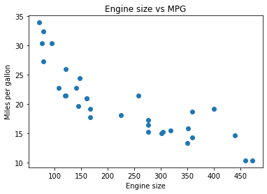

## Step by step
1. Create the ipynb file
2. Convert the ipynb file to markdown
3. Add the slide demarkers
4. Upload to the github repo
5. View
---


```python
import pandas as pd
import numpy as np
import matplotlib.pyplot as plt
import seaborn as sns
import ipywidgets as widgets
#from ipywidgets import output, interact
from bokeh.plotting import figure
from bokeh.io import output_notebook, show

```
---

```python
%%writefile testing.html
<!DOCTYPE html>
<html>
  <head>
    <title>Title</title>
    <meta charset="utf-8">
    <style>
      @import url(https://fonts.googleapis.com/css?family=Yanone+Kaffeesatz);
      @import url(https://fonts.googleapis.com/css?family=Droid+Serif:400,700,400italic);
      @import url(https://fonts.googleapis.com/css?family=Ubuntu+Mono:400,700,400italic);

      body { font-family: 'Droid Serif'; }
      h1, h2, h3 {
        font-family: 'Yanone Kaffeesatz';
        font-weight: normal;
      }
      .remark-code, .remark-inline-code { font-family: 'Ubuntu Mono'; }
    </style>
  </head>
  <body>
    <textarea id="source">

class: center, middle


    </textarea>
    <script src="remark-latest.min.js">
    </script>
    <script>
      var slideshow = remark.create({ 
        sourceUrl: 'testing.md'
       );
    </script>
  </body>
</html>

```
---
    


<div>
<style scoped>
    .dataframe tbody tr th:only-of-type {
        vertical-align: middle;
    }

    .dataframe tbody tr th {
        vertical-align: top;
    }

    .dataframe thead th {
        text-align: right;
    }
</style>
<table border="1" class="dataframe">
  <thead>
    <tr style="text-align: right;">
      <th></th>
      <th>Unnamed: 0</th>
      <th>mpg</th>
      <th>cyl</th>
      <th>disp</th>
      <th>hp</th>
      <th>drat</th>
      <th>wt</th>
      <th>qsec</th>
      <th>vs</th>
      <th>am</th>
      <th>gear</th>
      <th>carb</th>
    </tr>
  </thead>
  <tbody>
    <tr>
      <th>0</th>
      <td>Mazda RX4</td>
      <td>21.0</td>
      <td>6</td>
      <td>160.0</td>
      <td>110</td>
      <td>3.90</td>
      <td>2.620</td>
      <td>16.46</td>
      <td>0</td>
      <td>1</td>
      <td>4</td>
      <td>4</td>
    </tr>
    <tr>
      <th>1</th>
      <td>Mazda RX4 Wag</td>
      <td>21.0</td>
      <td>6</td>
      <td>160.0</td>
      <td>110</td>
      <td>3.90</td>
      <td>2.875</td>
      <td>17.02</td>
      <td>0</td>
      <td>1</td>
      <td>4</td>
      <td>4</td>
    </tr>
    <tr>
      <th>2</th>
      <td>Datsun 710</td>
      <td>22.8</td>
      <td>4</td>
      <td>108.0</td>
      <td>93</td>
      <td>3.85</td>
      <td>2.320</td>
      <td>18.61</td>
      <td>1</td>
      <td>1</td>
      <td>4</td>
      <td>1</td>
    </tr>
    <tr>
      <th>3</th>
      <td>Hornet 4 Drive</td>
      <td>21.4</td>
      <td>6</td>
      <td>258.0</td>
      <td>110</td>
      <td>3.08</td>
      <td>3.215</td>
      <td>19.44</td>
      <td>1</td>
      <td>0</td>
      <td>3</td>
      <td>1</td>
    </tr>
    <tr>
      <th>4</th>
      <td>Hornet Sportabout</td>
      <td>18.7</td>
      <td>8</td>
      <td>360.0</td>
      <td>175</td>
      <td>3.15</td>
      <td>3.440</td>
      <td>17.02</td>
      <td>0</td>
      <td>0</td>
      <td>3</td>
      <td>2</td>
    </tr>
  </tbody>
</table>
</div>


---



